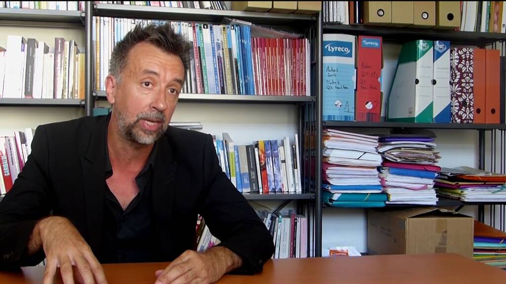

# Les procédures bâillons

## Les sondages de l'IFOP

<!--

-->

{ width="500" }

En avril 2022, le chercheur Alexandre Dezé est poursuivi par l'IFOP, le célèbre institut de sondage pour avoir critiqué la méthode utilisé par l'Institut dans plusieurs sondages dont un réalisé à la suite des attentats de Charlie-Hebdo. 

Ces poursuites contre un enseignant-chercheur spécialisé dans le domaine, montre aujourd'hui à quel point la protection des libertés académiques n'est pas simplement un problème en Chine ou en Inde mais concerne également nos démocratiques dans lesquelles des industrielles ou des entreprises de service n'hésitent pas à recourir aux procédures baîllons. 

## mariés au premier regard

<!--

-->

{ width="500" }

En 2018 déjà, le sociologue du couple, Jean-Claude Kauffman avait critiqué dans un article de la presse gratuite les impensés de l'émission "Mariés au premier regard" de M6 et surtout les stéréotypes et les erreurs du prétendu sociologue qui apportait une espèce de caution scientifique à l'émission. M6 avait peu de chances de gagner le procès intenté à Jean-Claude Kaufmann, mais la crainte de ces procès est de nature à inspirer à des équipes de recherche des réflexes d'autocensure en prévision des poursuites que leurs travaux pourraient déclencher de la part de ceux dont ils critiques la méthode ou le fonctionnement.